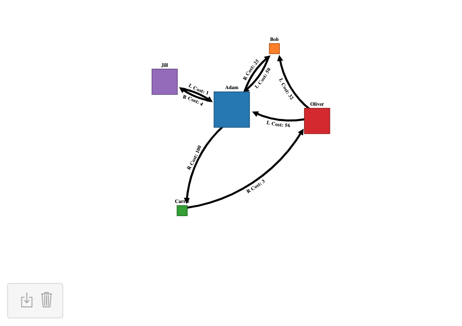

# Interactive Directed Graph Creator
## Functionality 
* Hold control and click anywhere empty to add a new node.
* Click on a node and drag to create edges between nodes. 
* Click on nodes and edges to select and deselect them.
* With an edge selected type "L", "R", or "B" to change if it points left, right, or in both directions.
* With a node selected type "R" to make it reflexive.
* With an edge or node selected press delete to remove them (deleting a node will remove its associated edges). 
* Hold shift and click on the nodes to drag them around.

* The download button allows you to save all data from the created graph to a JSON file.
* The garbage can button allows you to erase the graph you are working on.

## Example

## Demo
For a demo of this interactive directed graph creator see the following links (note that the second link is buggy with user input, first link works fully):
* https://jsfiddle.net/obe02/z7tg2u1b/
* https://bl.ocks.org/Oliver-BE/29a36997a32106192ce3d60c81afdfe5
